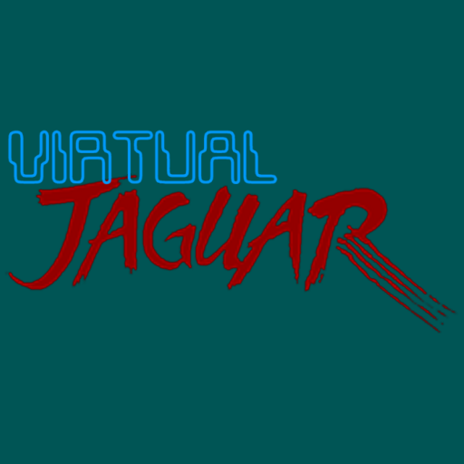
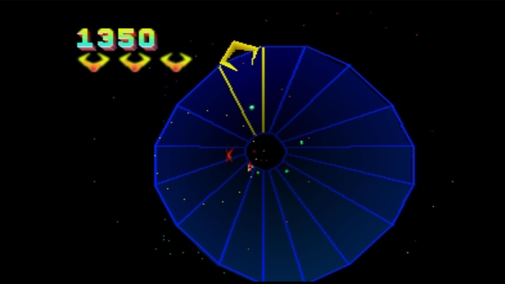
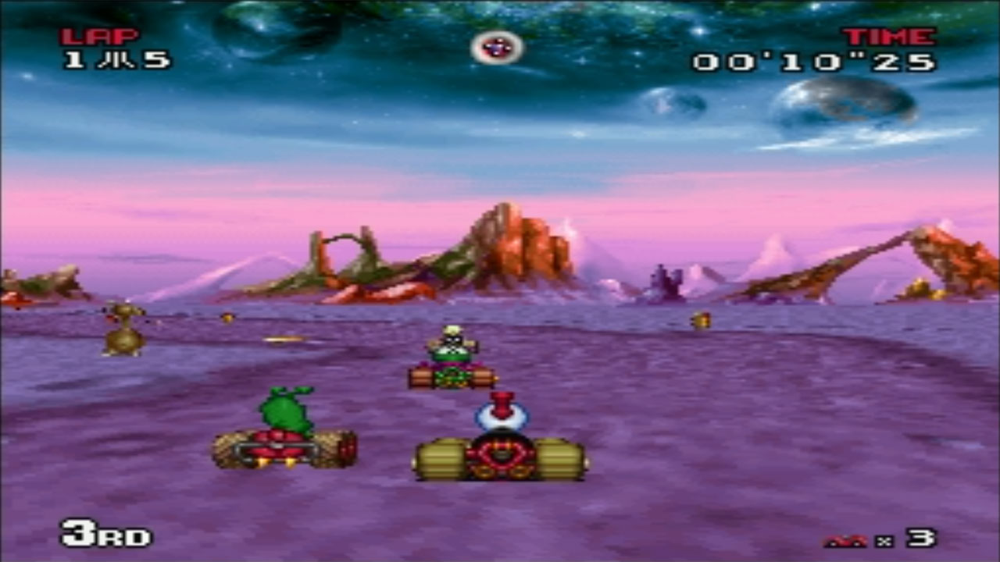
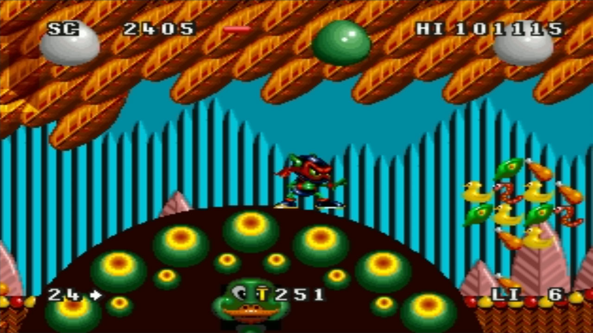

# Atari - Jaguar (Virtual Jaguar)

### Description

Virtual Jaguar is an emulator for the Atari Jaguar video game console.

Based on code released by David Raingeard (Cal2) of what used to be Potato Emulation.

### License

GPLv3

### Icon

### Fanart

Help make me fanart!

### Screenshots

